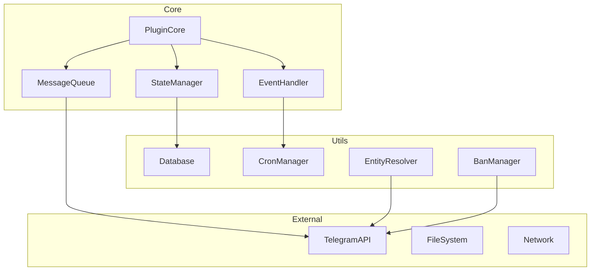
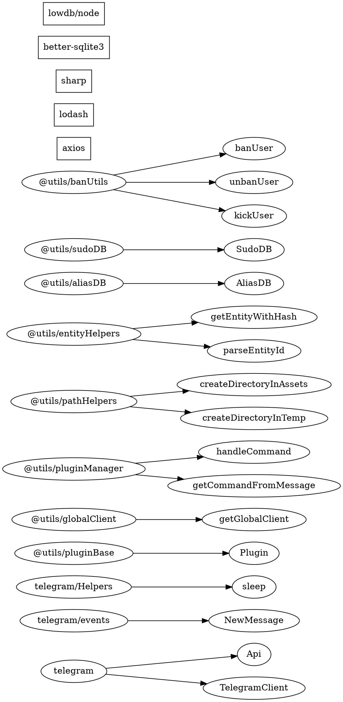

# TeleBox Formal Specification for AI Systems

## Abstract Syntax Tree Definition

```haskell
-- Core Type System
type SystemT = {
  runtime: RuntimeT,
  plugins: Set<PluginT>,
  state: StateT,
  constraints: Set<ConstraintT>
}

type RuntimeT = {
  client: TelegramClientT,
  environment: EnvironmentT,
  scheduler: SchedulerT,
  messageQueue: Queue<MessageT>
}

type PluginT = {
  identity: IdentityT,
  handlers: HandlerMapT,
  lifecycle: LifecycleT,
  invariants: Set<InvariantT>
}
```

## Formal Type System

```typescript
// Algebraic Data Types
type Message<T> = 
  | Text<T> 
  | Media<T> 
  | Composite<T[]>
  
type Handler<I, O> = I → Promise<O>
type Middleware<T> = T → T
type Transformer<A, B> = A → B

// Phantom Types for Compile-Time Safety
type Validated<T> = T & { readonly __validated: unique symbol }
type Sanitized<T> = T & { readonly __sanitized: unique symbol }
type Authorized<T> = T & { readonly __authorized: unique symbol }
```

## Core Contracts

```yaml
CONTRACT: Plugin
REQUIRES:
  - description ∈ String ∪ Function<*, String>
  - cmdHandlers: Map<String, Handler<Message, Unit>>
  - ∀ handler ∈ cmdHandlers: handler.pure = false
  - ∀ handler ∈ cmdHandlers: handler.idempotent = recommended
ENSURES:
  - plugin.initialized ⟹ plugin.valid
  - plugin.active ⟹ plugin.handlers.accessible
INVARIANTS:
  - message.length ≤ 4096
  - htmlEscape(userInput) = mandatory
  - plugin.state.consistent
```

## Module Graph



## State Machine Specification

```fsl
StateMachine PluginLifecycle {
  states: {
    UNLOADED,
    LOADING,
    LOADED,
    ACTIVE,
    SUSPENDED,
    ERROR
  }
  
  transitions: {
    UNLOADED → LOADING: load()
    LOADING → LOADED: validate() ∧ initialize()
    LOADED → ACTIVE: activate()
    ACTIVE → SUSPENDED: suspend()
    SUSPENDED → ACTIVE: resume()
    * → ERROR: exception()
    ERROR → UNLOADED: unload()
  }
  
  invariants: {
    state ∈ states
    ∀ t ∈ transitions: t.atomic = true
  }
}
```

## Function Signatures (Hindley-Milner)

```haskell
-- Core Functions
getGlobalClient :: () → IO (Maybe TelegramClient)
handleCommand :: Message → Command → IO ()
parseEntity :: String → Either Error Entity
htmlEscape :: String → SafeString

-- Message Operations  
edit :: Message → EditParams → IO Message
reply :: Message → ReplyParams → IO Message
delete :: Message → DeleteParams → IO ()
forward :: Message → Peer → IO Message

-- Database Operations
get :: Key → IO (Maybe Value)
set :: Key → Value → IO Bool
transaction :: (DB → IO a) → IO a

-- Utility Functions
sleep :: Int → IO ()
retry :: Int → IO a → IO (Maybe a)
parallel :: [IO a] → IO [a]
sequential :: [IO a] → IO [a]
```

## Constraint System

```prolog
% Message Constraints
valid_message(M) :- 
    length(M, L), 
    L =< 4096,
    escaped(M).

% Plugin Constraints
valid_plugin(P) :-
    has_description(P),
    has_handlers(P),
    \+ has_single_char_name(P).

% Command Constraints  
valid_command(C, Args) :-
    registered(C),
    valid_args(Args),
    authorized(sender).

% Reaction Constraints
valid_reaction(R) :-
    (standard_emoji(R); custom_emoji(R)),
    premium_required(R) -> has_premium(sender).
```

## Import Dependency Graph



## Error Monad

```haskell
data Result e a = Error e | Success a

instance Functor (Result e) where
    fmap f (Success a) = Success (f a)
    fmap _ (Error e) = Error e

instance Monad (Result e) where
    return = Success
    Success a >>= f = f a
    Error e >>= _ = Error e

-- Error Types
data TeleBoxError = 
    | FloodWait Int
    | MessageTooLong Int
    | EntityNotFound String
    | Unauthorized
    | NetworkError String
    | ParseError String
```

## Conversation Management

```haskell
-- Interactive Conversation Type
type ConversationT = {
  client: TelegramClientT,
  peer: EntityLike,
  state: ConversationState,
  timeout: Duration
}

data ConversationState = 
  | Idle
  | WaitingForMessage Duration
  | Processing Message
  | Completed
  | TimedOut

-- Conversation Operations
waitForMessage :: TelegramClient → EntityLike → Duration → IO (Either TimeoutError Message)
send :: ConversationT → String → IO ()
receive :: ConversationT → IO Message
ask :: ConversationT → String → IO String
```

## Authentication System

```typescript
type LoginManager = {
  start: (client: TelegramClient) => Promise<StringSession>
  phoneNumber: () => Promise<string>
  phoneCode: () => Promise<string>
  password: () => Promise<string>
  onError: (err: Error) => void
  storeSession: (session: StringSession) => void
}

type SessionState = 
  | Uninitialized
  | AwaitingPhone
  | AwaitingCode
  | AwaitingPassword
  | Connected
  | Failed<Error>
```

## Hook System

```fsl
StateMachine MessageHook {
  states: {
    ORIGINAL,
    INTERCEPTED,
    MODIFIED,
    FORWARDED,
    DROPPED
  }
  
  transitions: {
    ORIGINAL → INTERCEPTED: checkSudoUser()
    INTERCEPTED → MODIFIED: applySudoTransform()
    INTERCEPTED → FORWARDED: passthrough()
    MODIFIED → FORWARDED: send()
    * → DROPPED: shouldDrop()
  }
}

-- Hook Pipeline
type HookPipeline<T> = T → (T | Modified<T> | Dropped)
patchMsgEdit :: Message.edit → Message.edit
checkSudoPermission :: UserId → Boolean
```

## Process Management

```yaml
PM2Config:
  name: String
  script: ExecutableT
  args: String
  cwd: Path
  error_file: Path
  out_file: Path
  merge_logs: Boolean
  time: Boolean
  autorestart: Boolean
  max_restarts: Int
  min_uptime: Duration
  restart_delay: Duration
  env: Environment

ProcessState:
  - online
  - stopping
  - stopped
  - restarting
  - errored
```

## System Plugin Architecture

```haskell
-- System plugins vs User plugins distinction
data PluginType = SystemPlugin | UserPlugin

SystemPlugins = {
  alias: AliasManager,
  exec: CodeExecutor,
  help: HelpSystem,
  ping: HealthCheck,
  prefix: PrefixManager,
  reload: PluginReloader,
  sendLog: LogManager,
  sudo: PermissionManager,
  sure: ConfirmationSystem,
  sysinfo: SystemMonitor,
  tpm: PackageManager,
  update: UpdateManager
}

-- System plugin privileges
systemPluginPrivileges :: PluginType → Set<Privilege>
systemPluginPrivileges SystemPlugin = {
  RELOAD_PLUGINS,
  MODIFY_SYSTEM_STATE,
  EXECUTE_CODE,
  MANAGE_USERS,
  ACCESS_LOGS
}
```

## Dynamic Package Management

```typescript
interface NPMManager {
  install: (packages: string[]) => Promise<void>
  uninstall: (packages: string[]) => Promise<void>
  update: (packages: string[]) => Promise<void>
  list: () => Promise<InstalledPackage[]>
  resolve: (packageName: string) => Promise<PackageInfo>
}

type PackageState = 
  | NotInstalled
  | Installing
  | Installed<Version>
  | Updating
  | Failed<Error>
```

## Telebox Information Helper

```haskell
data SystemInfo = SystemInfo {
  version: Version,
  uptime: Duration,
  memory: MemoryStats,
  plugins: PluginStats,
  database: DatabaseStats,
  network: NetworkStats
}

getSystemInfo :: IO SystemInfo
getPluginStats :: IO PluginStats
getDatabaseStats :: IO DatabaseStats
```

## Protocol Specifications

```bnf
<plugin> ::= <metadata> <handlers> <listeners>? <crons>?
<metadata> ::= "description:" <string> | <function>
<handlers> ::= "{" <handler>+ "}"
<handler> ::= <identifier> ":" <async_function>
<async_function> ::= "async" "(" <params> ")" "=>" <block>
<params> ::= "msg" ("," "trigger")?
<block> ::= "{" <statement>* "}"
<statement> ::= <edit> | <reply> | <delete> | <control>

<system> ::= <login> <load_plugins> <start_listeners>
<login> ::= <interactive_login> | <session_login>
<interactive_login> ::= <phone_input> <code_input> <password_input>?
```

## Invariants & Properties

```alloy
sig Plugin {
    description: one Description,
    handlers: some Handler,
    state: one State
}

sig Message {
    id: one Int,
    text: lone String,
    sender: one Entity,
    chat: one Chat
}

fact MessageLengthConstraint {
    all m: Message | #m.text <= 4096
}

fact PluginNameConstraint {
    all p: Plugin | #p.name >= 2
}

pred validTransition[s, s': State] {
    (s = LOADED and s' = ACTIVE) or
    (s = ACTIVE and s' = SUSPENDED) or
    (s = SUSPENDED and s' = ACTIVE)
}

assert NoOrphanHandlers {
    all h: Handler | some p: Plugin | h in p.handlers
}
```

## Category Theory Model

```haskell
-- Plugin as Functor
instance Functor Plugin where
    fmap :: (a → b) → Plugin a → Plugin b
    fmap f plugin = plugin { 
        handlers = fmap (fmap f) (handlers plugin)
    }

-- Message as Monad
instance Monad Message where
    return :: a → Message a
    (>>=) :: Message a → (a → Message b) → Message b
    
-- Natural Transformations
sanitize :: RawMessage ~> SafeMessage
validate :: Input ~> Validated Input
authorize :: Request ~> Authorized Request
```

## Operational Semantics

```
                    msg ∈ Messages, cmd ∈ Commands
        ───────────────────────────────────────────────
        ⟨msg, σ⟩ →parse ⟨cmd, σ⟩


        cmd ∈ handlers(plugin), plugin ∈ active_plugins
        ─────────────────────────────────────────────────
        ⟨cmd, σ⟩ →exec ⟨result, σ'⟩


        length(msg) > 4096
        ──────────────────────────────────
        ⟨edit(msg), σ⟩ →error ⟨ERROR_TOO_LONG, σ⟩
```

## Configuration Schema

```json
{
  "$schema": "http://json-schema.org/draft-07/schema#",
  "type": "object",
  "required": ["apiId", "apiHash"],
  "properties": {
    "apiId": {
      "type": "string",
      "pattern": "^[0-9]+$"
    },
    "apiHash": {
      "type": "string",
      "pattern": "^[a-f0-9]{32}$"
    },
    "proxy": {
      "type": "object",
      "properties": {
        "ip": {"type": "string", "format": "ipv4"},
        "port": {"type": "integer", "minimum": 1, "maximum": 65535},
        "socksType": {"type": "integer", "enum": [4, 5]}
      }
    }
  }
}
```

## Lambda Calculus Representation

```lambda
-- Plugin Constructor
λplugin. λdesc. λhandlers. {
    description: desc,
    cmdHandlers: handlers,
    ignoreEdited: true
}

-- Message Handler
λmsg. λhandler. 
    let result = handler msg in
    case result of
        Success v → edit msg v
        Error e → edit msg (htmlEscape e)

-- Composition Operator
(∘) = λf. λg. λx. f (g x)

-- Pipeline Operator  
(|>) = λx. λf. f x
```

## Memory Model

```c
struct Plugin {
    void* description;      // 8 bytes
    HashMap* handlers;      // 8 bytes  
    bool ignoreEdited;      // 1 byte
    uint8_t padding[7];     // 7 bytes alignment
    void* listenHandler;    // 8 bytes
    CronTask* cronTasks;    // 8 bytes
};  // Total: 40 bytes aligned

struct Message {
    uint64_t id;           // 8 bytes
    char* text;            // 8 bytes
    Entity* sender;        // 8 bytes
    Chat* chat;            // 8 bytes
    Media* media;          // 8 bytes
    Entity** entities;     // 8 bytes
};  // Total: 48 bytes aligned
```

## Temporal Logic Specifications

```tla
MODULE TeleBoxSpec
VARIABLES state, queue, handlers

Init == 
    /\ state = "UNLOADED"
    /\ queue = <<>>
    /\ handlers = {}

LoadPlugin(p) ==
    /\ state = "UNLOADED"
    /\ state' = "LOADED"
    /\ handlers' = handlers ∪ p.handlers

ProcessMessage(m) ==
    /\ state = "ACTIVE"
    /\ ∃ h ∈ handlers : Applicable(h, m)
    /\ queue' = Tail(queue)

Invariant ==
    /\ state ∈ {"UNLOADED", "LOADED", "ACTIVE", "ERROR"}
    /\ Len(queue) ≤ 1000
    /\ ∀ m ∈ queue : Len(m.text) ≤ 4096

Spec == Init /\ □[Next]_vars
```

## Z Notation Specification

```z
┌─ TeleBoxSystem ────────────────
│ plugins : ℙ Plugin
│ messages : seq Message  
│ state : STATE
├────────────────────────────────
│ #messages ≤ 1000
│ ∀ p ∈ plugins • p.valid
│ state ∈ {ACTIVE, SUSPENDED}
└────────────────────────────────

┌─ ProcessMessage ───────────────
│ ΔTeleBoxSystem
│ m? : Message
│ h! : Handler
├────────────────────────────────
│ m? ∈ messages
│ ∃ p ∈ plugins • h! ∈ p.handlers
│ messages' = tail messages
└────────────────────────────────
```

## Performance Constraints

```yaml
performance:
  message_processing:
    latency_p50: 100ms
    latency_p99: 1000ms
    throughput: 1000msg/s
  
  database:
    read_latency: 10ms
    write_latency: 50ms
    transaction_overhead: 5ms
  
  memory:
    plugin_instance: 1MB
    message_buffer: 10MB
    max_heap: 512MB
  
  concurrency:
    max_parallel_handlers: 100
    worker_pool_size: CPU_CORES * 2
    queue_size: 10000
```

## Security Model

```typescript
interface SecurityContext {
  authentication: {
    verify: (token: Token) => Promise<boolean>
    refresh: (token: Token) => Promise<Token>
  }
  
  authorization: {
    check: (user: User, action: Action) => boolean
    sudo: (user: User) => boolean
  }
  
  sanitization: {
    html: (input: string) => SafeString
    sql: (query: string) => PreparedStatement
    path: (path: string) => NormalizedPath
  }
  
  encryption: {
    hash: (data: Buffer) => Hash
    encrypt: (data: Buffer, key: Key) => Encrypted
    decrypt: (encrypted: Encrypted, key: Key) => Buffer
  }
}
```

## Verification Conditions

```dafny
method HandleMessage(msg: Message) returns (result: Result)
  requires msg.length <= 4096
  requires msg.escaped
  ensures result.Success? ==> result.value.valid
{
  var cmd := ParseCommand(msg);
  assert cmd.Valid?;
  
  var handler := GetHandler(cmd);
  assert handler != null;
  
  result := handler.Execute(msg);
  assert result.Success? || result.Error?;
}

predicate Valid(p: Plugin) {
  p.description != null &&
  p.handlers.Count > 0 &&
  forall h :: h in p.handlers.Values ==> h != null
}
```

## Compilation Target

```wasm
(module
  (type $handler (func (param i32) (result i32)))
  (type $plugin (struct 
    (field $desc i32)
    (field $handlers (ref $handler))
  ))
  
  (func $processMessage (param $msg i32) (result i32)
    (local $handler i32)
    ;; Get handler for message
    local.get $msg
    call $getHandler
    local.set $handler
    
    ;; Execute handler
    local.get $msg
    local.get $handler
    call_indirect (type $handler)
  )
  
  (export "processMessage" (func $processMessage))
)
```

## End-to-End Trace

```
User Input → Telegram API → Message Queue → Parser → 
Command Extractor → Handler Resolver → Plugin Executor →
State Manager → Response Builder → HTML Sanitizer → 
Telegram API → User Output
```

## Metadata

```yaml
specification:
  version: 2.0.0
  formal_methods:
    - type_theory: Hindley-Milner
    - category_theory: Functors, Monads
    - temporal_logic: TLA+
    - model_checking: Alloy
    - theorem_proving: Dafny
    - process_calculus: CSP
  verification_tools:
    - static_analysis: TypeScript
    - runtime_verification: Contracts
    - model_checking: TLA+
    - theorem_proving: Z3
```
